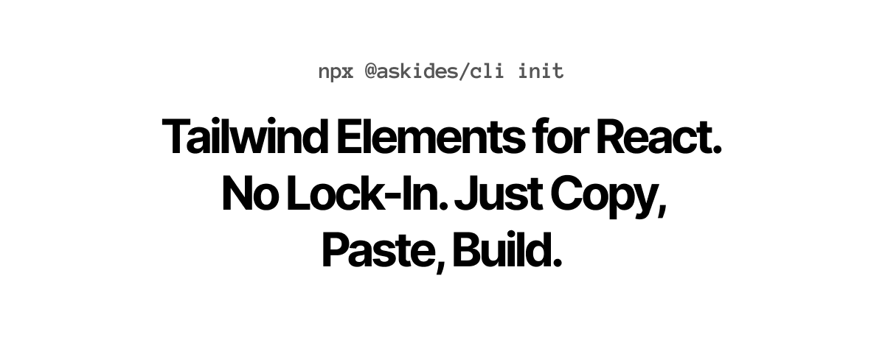

## Table of Contents

- [Installation](#installation)
- [Elements](#elements)
- [Motivation](#motivation)
- [Contributing](#contributing)

## Installation

Here's the quickest way to get started with Aski.

### 1. Install TailwindCSS

You need to have TailwindCSS installed in your project. Follow the [official documentation](https://tailwindcss.com/docs/installation) to get started.

> Be sure to install the `@tailwindcss/forms` plugin as well.

### 2. Initialize the CLI

```bash
npx @askides/cli init
```

This will install the CLI and create a new `.askides.json` file in your project root next to your `package.json` file.

### 3. Add an Element

```bash
npx @askides/cli add elements <element-name>
```

This command will add the desired element to your project and install the necessary dependencies for it.

### 4. Set up the TS Paths

Add the following to your `tsconfig.json` file:

```json
{
  "compilerOptions": {
    "baseUrl": "./",
    "paths": {
      "~elements/*": ["src/elements/*"],
      "~chunks/*": ["src/chunks/*"]
    }
  }
}
```

This will allow you to import the elements using the `~elements` and `~chunks` paths.

## Elements

The element list is still in development, but a few elements are already available.

- Shell
- Navbar
- Sidebar
- Pattern
- Page
- Button
- Input
- Card
- Table
- Label
- Avatar
- Badge

You can see all the available Elements in the [Storybook](https://elements.askides.com/).

### Examples

There's also a special section called `Examples`, where you can find UIs built using the Elements. You can install them as well using the CLI:

```bash
npx @askides/cli add examples <example-name>
```

## Motivation

I've been using Shadcn's UI for a while now, and I love the simplicity and ease of use it provides.

This is my attempt to create a similar collection of components as a learning experience and with some personal touch.

## Contributing

Right now, Aski is in its early stages, and I'm still figuring out how to structure the components and the CLI. If you have any suggestions or want to contribute, feel free to open an issue or a PR.
